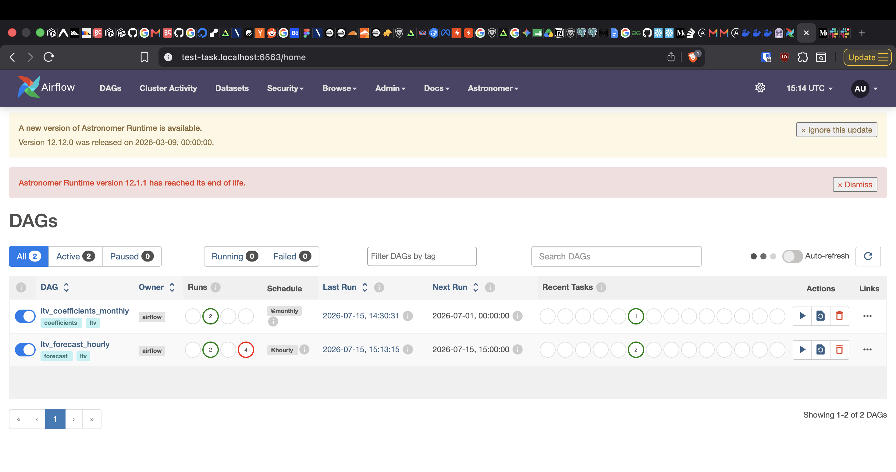
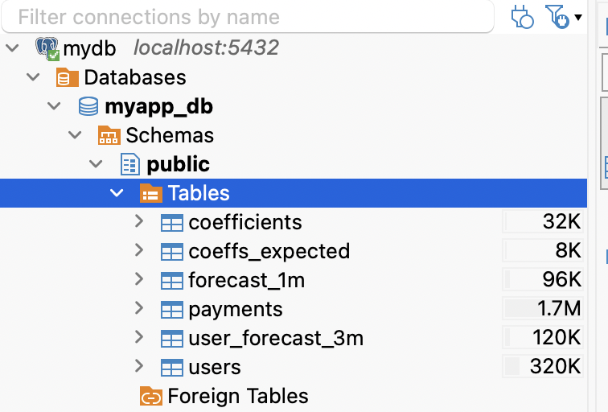
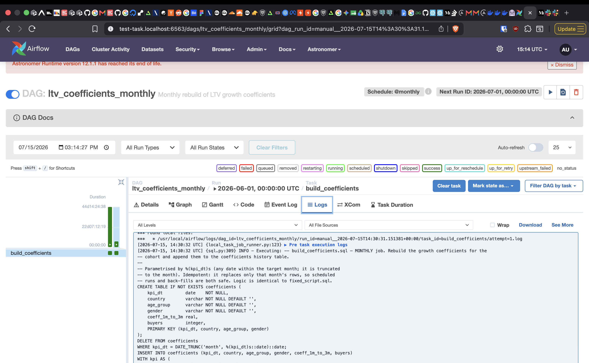
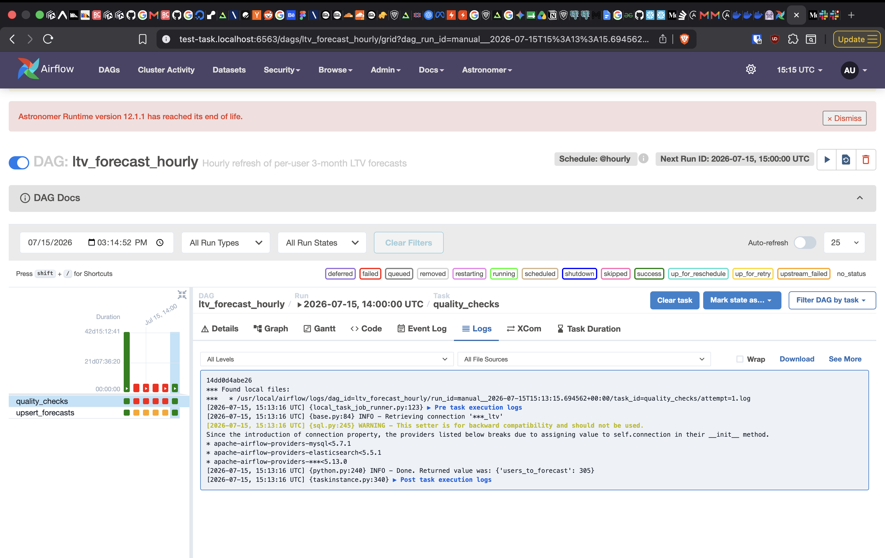
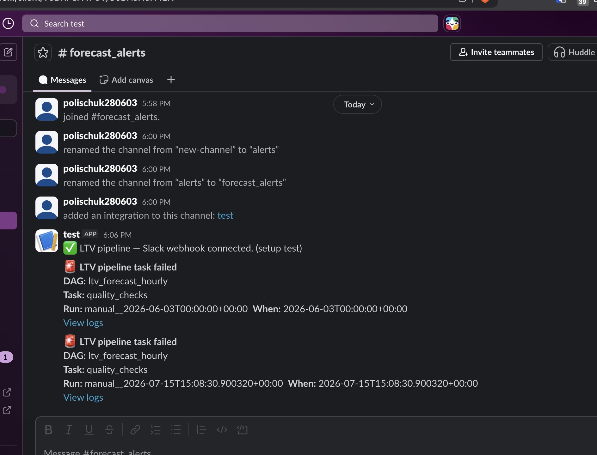

# LTV forecast pipeline (Astronomer / Airflow)

Turns a per-user **1-month** revenue forecast into a **3-month** one, and runs it
automatically on a schedule (Airflow, hosted on Astronomer).

## What's in here — start here

| Where | What it is |
|---|---|
| **`fixed_script.sql`** | **Part 1** — the corrected coefficients query.  |
| **`forecast_script.sql`** | **Part 2** — the forecast query. Turns each user's 1-month forecast into a 3-month one (`forecast_3m = forecast_1m × (1 + multiplier)`). |
| **`screenshoots/`** | Screenshots of everything running — the pipes in Airflow, the data loaded in Postgres, and the Slack alert. |
| **`dags/`** | The two **pipes** that run it all on a schedule — explained just below. |
| `include/sql/` | The same SQL as the two scripts above, wired for the pipes (parametrised + writes straight to the tables). |
| `include/` | Supporting code: connection ids (`config.py`), the Slack alert (`notifications.py`), the data-quality checks (`quality_checks.py`). |

## The two pipes — what runs automatically

A "pipe" is just a job that Airflow runs on a schedule and shows as green (ok) or
red (failed). There are two, and each is one of the SQL scripts above, automated:

| Pipe | Runs | In plain words | Under the hood |
|---|---|---|---|
| **`ltv_coefficients_monthly`** | once a month | Recalculates the growth multipliers from users who now have a full 3 months of history, and saves them. | `fixed_script.sql` → fills the `coefficients` table |
| **`ltv_forecast_hourly`** | every hour | Checks the incoming data looks sane, then refreshes every user's 3-month forecast. If a check fails it writes nothing and pings Slack. | `forecast_script.sql` → updates the `user_forecast_3m` table |

(`pipeline.py` is a plain-Python version of the hourly pipe, kept as a
non-Airflow reference.)

## Screenshots
In [`screenshoots/`](screenshoots/):

| The two pipes in Airflow | Data loaded in Postgres |
|---|---|
|  |  |
| **Monthly pipe run** | **Hourly pipe run** |
|  |  |
| **Slack alert on a failed run** | |
|  | |

## Connections (create in Astro UI, or locally in `airflow_settings.yaml`)
- **`postgres_ltv`** (Postgres) — the DB with `users`, `payments`, `forecast_1m`
  (and the pipeline-owned `coefficients`, `user_forecast_3m`).
- **`slack_default`** (Slack Incoming Webhook) — failure alerts.

Override defaults via env vars if needed: `LTV_POSTGRES_CONN_ID`,
`LTV_SLACK_CONN_ID`, `FORECAST_MAX_USD`, `FORECAST_STALE_HOURS`, `MIN_BATCH_ROWS`.

## Failure alerts (Slack)
Any task failure — including the data-quality gate — posts to Slack via the
`slack_default` Incoming Webhook (`on_failure_callback = failure_alert`).

**Set it up / test it:**
1. Put your Incoming Webhook token in the `slack_default` connection
   (Airflow UI → Admin → Connections, or `airflow_settings.yaml`).
2. Trigger a failure — easiest on this frozen dataset, the freshness guard fails:
   ```bash
   astro dev run dags test ltv_forecast_hourly 2026-06-03
   ```
   → `quality_checks` fails "stale data" → a Slack message lands in your channel.

## Run locally
Requires Docker + the [Astro CLI](https://docs.astronomer.io/astro/cli/install-cli).
```bash
astro dev start                 # boots Airflow locally
# edit airflow_settings.yaml with your DB + Slack webhook (it auto-loads)
astro dev pytest                # DAG integrity tests
```
Then in the Airflow UI (localhost:8080):
1. Trigger **`ltv_coefficients_monthly`** with config `{"kpi_dt": "2026-06-01"}`
   → `coefficients` gets the June rows (60 segments).
2. Trigger **`ltv_forecast_hourly`** → `user_forecast_3m` gets 305 rows,
   every `forecast_3m_usd ≥ forecast_1m_usd`.
3. To see the guard: point at a month with no coefficients (or empty
   `forecast_1m`) → `quality_checks` fails, `upsert_forecasts` is skipped, Slack fires.

> Note: this dataset is a frozen snapshot ending June 2026, so pin `kpi_dt` to
> June for testing. In production `kpi_dt` defaults to the run's logical date.

## Deploy to Astronomer
```bash
astro login                     # or export ASTRO_API_TOKEN=...
astro deploy                    # pushes to your deployment
```
Set the `postgres_ltv` and `slack_default` connections on the deployment, and
match the `Dockerfile` runtime tag to your deployment's Astro Runtime version.


## How I approached it

Quick plain-English version of what this project even does: for every new user we
want to guess how much money they'll bring in over their first 3 months, starting
from a forecast we already have for their first month. The trick is a "growth
multiplier" (the coefficient) — a number that basically says "people like this
usually spend about X times more over 3 months than they did in month one",
worked out separately for each kind of user (country, age group, gender).

First I looked at the dataset and then at the SQL script. I set up a Postgres
database locally and imported the data there so I could query it, then ran the
script - it didn't work. It was written for a different database engine, so i
re-wrote the parts Postgres doesn't have (swapped a couple of functions, fixed
how it reads dates). Then it worked.

Then i compared my results to the expected ("correct") values from the finance
team and they didn't match. So i started digging into the data - turned out there
were duplicate payments, some payments dated before the user had even registered,
and the script was averaging over the wrong group of people. I fixed the filtering
(right group of users, only real paying customers, no duplicates) and simplified
the query along the way. After that my numbers matched the expected ones exactly.

Then i wrote the forecast script using almost the same logic as in the fixed
script - for each user it grabs their latest 1-month forecast, finds their
multiplier, and gives back the 3-month number.

After these steps i started to think about orchestration - basically, how to run
all of this automatically on a schedule instead of by hand - and decided to do it
the classic way with Airflow (a tool that runs data jobs on a timetable and shows
you what passed or failed).

Instead of using clean Airflow and setting up lots of Docker containers myself, i
decided to use Astronomer Airflow - the infrastructure is managed, so it's already
set up for me. I wrote 2 pipes (pipelines): one rebuilds the multipliers once a
month, the other refreshes everyone's 3-month forecast every hour. I created a
Slack channel and a webhook (a link that lets a program post messages into that
channel), added the secrets to the envs, and ran the pipes. I verified that they
actually loaded data into the database and that the data is there. I also failed a
pipe on purpose to check whether the Slack alert works (it does) - i added
screenshots so you can take a look.